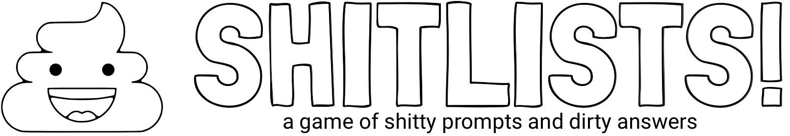

Shitlists! is a game that slowly evolved during the 2020 pandemic. My family, living in three locations across the US and missing one another, started using FaceTime to play made-up games that were variations on commercial board and party video games. Gradually, Shitlists! was born. 

It's fun, dirty, able to be played virtually, and much like "Whose Line is it Anyway?", the points don't matter nearly as much as the fun had (though we do keep score...).

We recommend you start by simply downloading the packet below:

__[Download Shitlists!](https://github.com/efats/shitlists/raw/master/shitlists.pdf)__

It includes instructions, as well as all the lists so far created. It's all you need to get going. Well almost: you'll also need something to roll random letters, and a stopwatch too. Wouldn't it be great if we had a small personal electronic device that could do both those things?!

## Development

I work on a Mac. As such, each list is an [Apple Pages](https://apps.apple.com/us/app/pages/id409201541?ls=1&mt=12) file. The logos are [Pixelmator Pro](https://apps.apple.com/us/app/pixelmator-pro/id1289583905?mt=12) files. Sorry to Linux folks; this is how I roll. Windows users: I don't apologize.

Feel free to submit PRs if you make new lists, or have good ideas. Note hate allowed.

## License

I selected the [Creative Commons Attribution-NonCommercial-ShareAlike 4.0 International](https://creativecommons.org/licenses/by-nc-sa/4.0/) license for Shitlists! The idea is that I want to enable you to do virtually anything, including derivative works, so long as you also pay that goodwill forward. Commercial uses are *not* allowed; let's __be excellent to one another__.

## Credits

[pile of poo](https://thenounproject.com/search/?q=shit&i=1058250) by Anniken & Andreas from the Noun Project

[coronavirus](https://thenounproject.com/search/?q=coronavirus&i=3381778) by monkik from the Noun Project

[gardener](https://thenounproject.com/search/?q=garden&i=2147139) by ProSymbols from the Noun Project

[londrina](https://fonts.google.com/specimen/Londrina+Outline?query=outline) by Marccelo Magalhaes from Google

[roboto font](https://fonts.google.com/specimen/Roboto) by Christian Robertson from Google